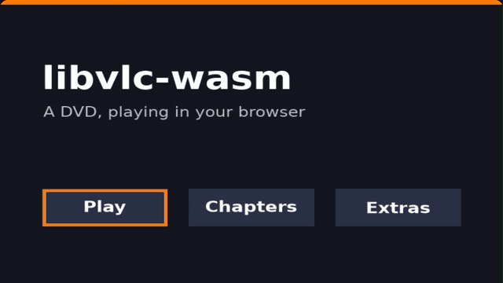

# libvlc-wasm

libvlc-wasm compiles VLC 4's engine to WebAssembly and offers it as a JavaScript SDK. The package, in doing so, lets developers play media files that browsers [cannot handle natively](https://libvlc.lucasgelfond.online/formats). This includes some wacky stuff like playing DVD menus in the browser:



It handles a pretty baffling number of formats and is quite performant, making use of fast web technologies like WebGL for the video player and WebCodecs for native-speed decoding. It does not load whole videos into memory, but rather uses file seeks; memory use stays flat with large files. It's very fast; it can play native-codec supported files through at >600fps on my Mac, and even the slowest cases are several multiples better than realtime. It's also much more performant than simply transcoding something with ffmpeg.wasm and playing it in the browser.

## Comparisons to other work

libvlc-wasm exceeds native VLC 3 compatibility and is near parity with VLC 4. See full compatibility [on the site](https://libvlc.lucasgelfond.online/formats). You can also see its [pass rate on test suites](https://libvlc.lucasgelfond.online/tests) and [speed benchmarks](https://libvlc.lucasgelfond.online/benchmarks).

There's some [prior](https://code.videolan.org/jbk/vlc.js) [art](https://github.com/addyosmani/vlc.js) [here](https://github.com/Krowemoh/vlc.js) but most efforts at "VLC in the browser" use an older, prebuilt WASM bundle. Inspired by [ffmpeg.wasm](https://github.com/ffmpegwasm/ffmpeg.wasm), which I co-maintain, libvlc-wasm includes the tooling to easily rebuild from source on top of VLC source code. This package also includes a pretty extensive testing harness that makes it easy to make changes or bump the source commit without lots of manual checks.

## A note on LLMs

I used LLMs, particularly Claude Opus 5.5, very heavily in development here. In essence: I pointed Claude at the libvlc source, a set of obscure-format files to test with, some reference implementations from the internet, and some existing native-library-to-wasm ports like [@uswriting/exiftool](https://github.com/6over3/exiftool), [neslinesli93/qpdf-wasm](https://github.com/neslinesli93/qpdf-wasm), and [dlemstra/magick-wasm](https://github.com/dlemstra/magick-wasm). I steered a bunch throughout re what to include/leave out, how to implement patching / benchmarking / testing. I also built the demo interface, did manual QA, and wrote the words in this README and on the site.

In essence, this is to say: I am greatly indebted to the work that precedes this, particularly the existing libvlc source; little of this is truly "original." I think it remains valuable to publish packages like this because they are composable, reusable, and abstract complexity for other developers. For example, rather than spending a few days wrangling WASM, spending a ton of tokens, and wrangling Claude, other developers can just install the SDK. In any case though: this is very much glue work on top of [lots of phenomenal prior art](https://x.com/garrytan/status/1909255029372203090) (including other vlc.js-in-the-browser implementations).

[AGENTS.md](AGENTS.md) includes a much more verbose description of how the package was constructed, and also how to install / use its API.

### Using this package

```sh
npm install libvlc-wasm          # playback, probing, thumbnails
npm install libvlc-wasm-sout     # optional: transcoding, remuxing, recording
```

**HTML**

```html
<script type="module">import 'libvlc-wasm/element';</script>
<vlc-player src="old-trailer.rm" controls autoplay></vlc-player>
```

**JavaScript**

```js
import { createVLC } from 'libvlc-wasm';

const vlc = await createVLC();                     // one engine per page
const player = await vlc.createPlayer({ canvas }); // draws into a <canvas>
await player.open(fileInput.files[0]);             // File, Blob, bytes or URL
player.on('timeupdate', (t) => console.log(t, player.duration));

console.log(await vlc.probe(file));                // tracks and metadata, no playback
```

**React**

```jsx
import 'libvlc-wasm/element';

export function Video({ src }) {
  return <vlc-player src={src} controls style={{ width: '100%', aspectRatio: '16 / 9' }} />;
}
```

**Svelte**

```svelte
<script>
  import { createVLC } from 'libvlc-wasm';
  let { file } = $props();
  let canvas;
  $effect(() => {
    let player;
    createVLC().then(async (vlc) => {
      player = await vlc.createPlayer({ canvas });
      await player.open(file);
    });
    return () => player?.destroy();
  });
</script>

<canvas bind:this={canvas}></canvas>
```

Note that in any case, pages must be cross-origin isolated so that they can use `SharedArrayBuffer`. Set these two headers on every response:

```
Cross-Origin-Opener-Policy: same-origin
Cross-Origin-Embedder-Policy: require-corp
```

## Building from source

The build fetches VLC, builds its dependencies (FFmpeg, dav1d, libass, etc). It takes about 20 minutes on my M5 MacBook Pro, probably an hour or so on a CI runner. It needs Docker.

```sh
./build.sh                    # toolchain image, VLC for wasm, link → packages/core/wasm/
./build.sh link               # relink only (a minute or two): after changing native/
PROFILE=debug ./build.sh      # assertions and symbols
VARIANT=sout ./build.sh       # the stream-output build (libvlc-sout.wasm), its own build tree
VLC_COMMIT=<sha> ./build.sh   # try another VLC master commit
WITH_DVDCSS=1 ./build.sh      # your own engine with libdvdcss → build/engines/dvdcss/
```

Passing the argument `WITH_DVDCSS=1` will bundle CSS-encrypted DVD processing into your binary. This is disabled in the default build because [distributing libdvdcss has questionable legal status](https://en.wikipedia.org/wiki/Libdvdcss). The engine it builds is never packaged or published; serve its two files yourself and load them with `createVLC({ engine: { moduleUrl, wasmUrl } })`.

## License

A ton of the dependencies rely on the GPL. I love free software but also you should use this package however you want. **The code in this repository — the SDK, the patches, the build scripts, bridge, tests, benchmarks, player app — are all [licensed under MIT](LICENSE).**

The compiled engine / binary this ships, however, is based on libvlc which is LGPL-2.1+, and links to many GPL modules. As such, the whole binary is [GPL](COPYING).
